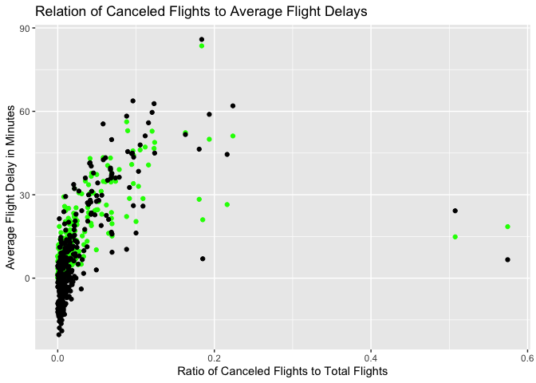

Stat433HW1
================

``` r
library(nycflights13)
library(ggplot2)
library(tidyr)
library(tidyverse)
```

    ## ── Attaching packages ─────────────────────────────────────── tidyverse 1.3.1 ──

    ## ✔ tibble  3.1.6     ✔ dplyr   1.0.8
    ## ✔ readr   2.0.1     ✔ stringr 1.4.0
    ## ✔ purrr   0.3.4     ✔ forcats 0.5.1

    ## Warning: package 'dplyr' was built under R version 4.1.2

    ## ── Conflicts ────────────────────────────────────────── tidyverse_conflicts() ──
    ## ✖ dplyr::filter() masks stats::filter()
    ## ✖ dplyr::lag()    masks stats::lag()

``` r
library(dplyr)
```

``` r
#q1a
missing_dep_time <- flights[is.na(flights$dep_time),] 
nrow(missing_dep_time)
```

    ## [1] 8255

``` r
print("There are 8255 missing vales in dep_time")
```

    ## [1] "There are 8255 missing vales in dep_time"

``` r
#q1b
summary(flights)
```

    ##       year          month             day           dep_time    sched_dep_time
    ##  Min.   :2013   Min.   : 1.000   Min.   : 1.00   Min.   :   1   Min.   : 106  
    ##  1st Qu.:2013   1st Qu.: 4.000   1st Qu.: 8.00   1st Qu.: 907   1st Qu.: 906  
    ##  Median :2013   Median : 7.000   Median :16.00   Median :1401   Median :1359  
    ##  Mean   :2013   Mean   : 6.549   Mean   :15.71   Mean   :1349   Mean   :1344  
    ##  3rd Qu.:2013   3rd Qu.:10.000   3rd Qu.:23.00   3rd Qu.:1744   3rd Qu.:1729  
    ##  Max.   :2013   Max.   :12.000   Max.   :31.00   Max.   :2400   Max.   :2359  
    ##                                                  NA's   :8255                 
    ##    dep_delay          arr_time    sched_arr_time   arr_delay       
    ##  Min.   : -43.00   Min.   :   1   Min.   :   1   Min.   : -86.000  
    ##  1st Qu.:  -5.00   1st Qu.:1104   1st Qu.:1124   1st Qu.: -17.000  
    ##  Median :  -2.00   Median :1535   Median :1556   Median :  -5.000  
    ##  Mean   :  12.64   Mean   :1502   Mean   :1536   Mean   :   6.895  
    ##  3rd Qu.:  11.00   3rd Qu.:1940   3rd Qu.:1945   3rd Qu.:  14.000  
    ##  Max.   :1301.00   Max.   :2400   Max.   :2359   Max.   :1272.000  
    ##  NA's   :8255      NA's   :8713                  NA's   :9430      
    ##    carrier              flight       tailnum             origin         
    ##  Length:336776      Min.   :   1   Length:336776      Length:336776     
    ##  Class :character   1st Qu.: 553   Class :character   Class :character  
    ##  Mode  :character   Median :1496   Mode  :character   Mode  :character  
    ##                     Mean   :1972                                        
    ##                     3rd Qu.:3465                                        
    ##                     Max.   :8500                                        
    ##                                                                         
    ##      dest              air_time        distance         hour      
    ##  Length:336776      Min.   : 20.0   Min.   :  17   Min.   : 1.00  
    ##  Class :character   1st Qu.: 82.0   1st Qu.: 502   1st Qu.: 9.00  
    ##  Mode  :character   Median :129.0   Median : 872   Median :13.00  
    ##                     Mean   :150.7   Mean   :1040   Mean   :13.18  
    ##                     3rd Qu.:192.0   3rd Qu.:1389   3rd Qu.:17.00  
    ##                     Max.   :695.0   Max.   :4983   Max.   :23.00  
    ##                     NA's   :9430                                  
    ##      minute        time_hour                  
    ##  Min.   : 0.00   Min.   :2013-01-01 05:00:00  
    ##  1st Qu.: 8.00   1st Qu.:2013-04-04 13:00:00  
    ##  Median :29.00   Median :2013-07-03 10:00:00  
    ##  Mean   :26.23   Mean   :2013-07-03 05:22:54  
    ##  3rd Qu.:44.00   3rd Qu.:2013-10-01 07:00:00  
    ##  Max.   :59.00   Max.   :2013-12-31 23:00:00  
    ## 

``` r
print('There are missing values in dep_time, dep_delay, arr_time, arr_delay, and air_time')
```

    ## [1] "There are missing values in dep_time, dep_delay, arr_time, arr_delay, and air_time"

``` r
#q1c
print('I think that these missing values likely represent canceled flights or possible data entry errors.')
```

    ## [1] "I think that these missing values likely represent canceled flights or possible data entry errors."

``` r
#q2
flights %>% 
  mutate(minutes_dep_time = 60 * floor(dep_time/100) + (dep_time - floor(dep_time/100) * 100)) %>% 
  mutate(minutes_sched_dep_time = 60 * floor(sched_dep_time/100) + (sched_dep_time -    floor(sched_dep_time/100) * 100))
```

    ## # A tibble: 336,776 × 21
    ##     year month   day dep_time sched_dep_time dep_delay arr_time sched_arr_time
    ##    <int> <int> <int>    <int>          <int>     <dbl>    <int>          <int>
    ##  1  2013     1     1      517            515         2      830            819
    ##  2  2013     1     1      533            529         4      850            830
    ##  3  2013     1     1      542            540         2      923            850
    ##  4  2013     1     1      544            545        -1     1004           1022
    ##  5  2013     1     1      554            600        -6      812            837
    ##  6  2013     1     1      554            558        -4      740            728
    ##  7  2013     1     1      555            600        -5      913            854
    ##  8  2013     1     1      557            600        -3      709            723
    ##  9  2013     1     1      557            600        -3      838            846
    ## 10  2013     1     1      558            600        -2      753            745
    ## # … with 336,766 more rows, and 13 more variables: arr_delay <dbl>,
    ## #   carrier <chr>, flight <int>, tailnum <chr>, origin <chr>, dest <chr>,
    ## #   air_time <dbl>, distance <dbl>, hour <dbl>, minute <dbl>, time_hour <dttm>,
    ## #   minutes_dep_time <dbl>, minutes_sched_dep_time <dbl>

``` r
#q3
flights %>%
  mutate(dep_date_ymd = lubridate::make_datetime(year, month, day)) %>%
  group_by(dep_date_ymd) %>%
  summarize(canceled = sum(is.na(dep_delay)), 
            n = n(), 
            average_dep_delay = mean(dep_delay,na.rm=TRUE), average_arr_delay = mean(arr_delay,na.rm=TRUE)) %>%
    ggplot() + 
    geom_point(aes(x= canceled/n, y=average_dep_delay), color='green') + 
    geom_point(aes(x= canceled/n, y=average_arr_delay), color='black') + 
    xlab('Ratio of Canceled Flights to Total Flights') +
    ylab('Average Flight Delay in Minutes') +
    ggtitle("Relation of Canceled Flights to Average Flight Delays")
```

<!-- -->

``` r
print("It appears there is a strong relation between average delays and the ratio of canceled flights to total flights.")
```

    ## [1] "It appears there is a strong relation between average delays and the ratio of canceled flights to total flights."
